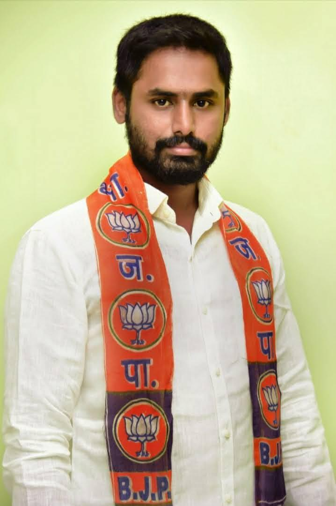

# KTS Kavin - Official Portfolio Website



A modern, responsive portfolio website for **KTS Kavin**, BJP Youth Wing Leader dedicated to empowering youth and transforming communities in Tamil Nadu.

## 🌟 Overview

This professional portfolio showcases KTS Kavin's political journey, achievements, vision, and ongoing community initiatives. Built with modern web technologies, the site serves as a platform for civic engagement, volunteer recruitment, and community outreach.

## ✨ Features

- **🎯 Professional Design**: Clean, modern interface with BJP color scheme
- **📱 Fully Responsive**: Optimized for all devices and screen sizes
- **🚀 Fast Performance**: Built with Next.js for optimal loading speeds
- **🔍 SEO Optimized**: Complete meta tags, Open Graph, and social sharing
- **♿ Accessible**: WCAG compliant with semantic HTML and ARIA labels
- **📸 Interactive Gallery**: Photo gallery with lightbox and category filtering
- **📝 Contact Forms**: Functional contact and volunteer registration forms
- **🔗 Social Integration**: Links to Instagram and X (Twitter)

## 🛠️ Technology Stack

- **Framework**: Next.js 15.5.2 with App Router
- **Language**: TypeScript
- **UI Components**: shadcn UI
- **Styling**: Tailwind CSS
- **Forms**: React Hook Form with validation
- **Images**: Next.js Image optimization
- **Deployment**: Vercel (recommended)

## 📚 Website Structure

### Pages
1. **Home** - Hero section, focus areas, key achievements
2. **About** - Biography, education, political journey, values
3. **Campaigns** - Blood donation drives, community initiatives, rallies
4. **Vision** - Goals for youth empowerment, education, entrepreneurship
5. **Gallery** - Categorized photo collection with lightbox
6. **Get Involved** - Volunteer registration and partnership opportunities
7. **Contact** - Contact form, office information, and location

### Key Components
- Responsive navigation header
- Hero section with call-to-action
- Interactive photo gallery
- Contact and volunteer forms
- Social media integration
- SEO-optimized layout

## 🚀 Quick Start

1. **Install Dependencies**
   ```bash
   npm install
   ```

2. **Start Development Server**
   ```bash
   npm run dev
   ```

3. **View in Browser**
   Open [http://localhost:3000](http://localhost:3000)

## 📱 Responsive Design

The website is fully responsive and optimized for:
- 📱 Mobile devices (320px+)
- 📱 Tablets (768px+)
- 💻 Desktops (1024px+)
- 🖥️ Large screens (1440px+)

## 🎨 Design System

### Colors
- **Primary Red**: `#FF3B30` (BJP Red)
- **Secondary**: White, Gray shades
- **Accent**: Various theme colors for categories

### Typography
- **Headings**: Bold, professional fonts
- **Body**: Readable, clean typography
- **Hierarchy**: Clear content structure

## 📊 SEO & Analytics

- Meta titles and descriptions for all pages
- Open Graph tags for social media sharing
- Twitter Card metadata
- Google-friendly URL structure
- Structured data ready for implementation

## 🤝 Contributing

### Content Updates
- Personal information: Edit component files
- Gallery images: Add to `public/collections/`
- Contact details: Update in multiple components
- Social links: Modify `SocialLinks.tsx`

### Development
1. Fork the repository
2. Create a feature branch
3. Make your changes
4. Test thoroughly
5. Submit a pull request

## 📞 Contact Information

**KTS Kavin**
- 📍 72/23,24 Chennimalai Road, Perundurai – 638052, Tamil Nadu
- 📞 99948-94844
- ✉️ kavin95pri@gmail.com
- 📱 Instagram: [@kts_kavin_bjp](https://instagram.com/kts_kavin_bjp)
- 🐦 X: [@bjp_KTS_Kavin](https://x.com/bjp_KTS_Kavin)

## 📄 License

This website is developed for KTS Kavin's political activities and public service initiatives.

## 🙏 Acknowledgments

- **BJP Tamil Nadu** - Political party affiliation
- **Community Volunteers** - Ongoing support and participation
- **Developers** - Technical implementation and maintenance

---

**Built with ❤️ for community service and political engagement**

*Last Updated: September 2025*
